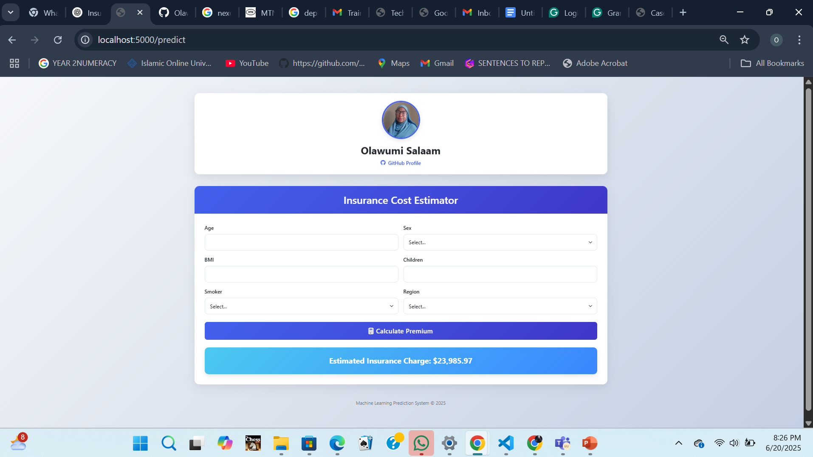

# Insurance Pricing Prediction with XGBoost Regressor

## 🚀 Project Overview

This project predicts **insurance charges** based on user-specific features using machine learning. It provides a clean web UI for users to interact with the model, and it's designed for easy deployment via **Flask API** on **AWS Elastic Beanstalk**.



### ✅ Goal:
Build an end-to-end ML pipeline that:
- Trains regression models on insurance data.
- Supports real-time predictions through a web interface and JSON API.
- Is production-ready for deployment.

---

## 🔍 Features

- ✅ Modular pipeline structure (`data_ingestion`, `transformation`, `training`, `prediction`)
- ✅ Real-time predictions via:
  - Web UI (HTML form)
  - JSON API endpoint
- ✅ Error handling and logging
- ✅ `/health` endpoint for monitoring
- ✅ Deployable to **AWS Elastic Beanstalk** using `Gunicorn`

---

## 🧠 ML Models Used

- [XGBoost Regressor](https://xgboost.readthedocs.io/)
- [CatBoost Regressor](https://catboost.ai/)
- Random Forest Regressor
- AdaBoost Regressor
- Ensemble Models: **Voting** & **Stacking**

---

## ⚙️ Tech Stack

| Category      | Tools / Technologies                           |
|---------------|------------------------------------------------|
| Language      | Python 3.8+                                    |
| ML Libraries  | Scikit-learn, XGBoost, CatBoost, Pandas        |
| Web Framework | Flask                                          |
| Deployment    | AWS Elastic Beanstalk, Gunicorn                |
| Frontend      | HTML, CSS, Bootstrap                           |
| Others        | Logging, JSON, Jupyter Notebooks               |

---

## 🖥️ Local Setup Instructions

### 1. Clone the repository

```bash
git clone https://github.com/OlawumiSalaam/insurance-pricing-prediction-pipeline.git
cd insurance-pricing-prediction-pipeline
```

---

### 2. Set up the virtual environment

```bash
# For Windows
python -m venv venv
venv\Scripts\activate

# For macOS/Linux
python3 -m venv venv
source venv/bin/activate
```

---

### 3. Install dependencies

```bash
pip install -r requirements.txt
```

---

### 4. Run the Flask app

```bash
python app.py
```

---

## 🔁 Example Prediction (API)

You can make a `POST` request to `/predict` with JSON data.

### Request

```http
POST /predict
Content-Type: application/json
```

```json
{
  "age": 45,
  "sex": "female",
  "bmi": 28.5,
  "children": 2,
  "smoker": "yes",
  "region": "southwest"
}
```

### Response

```json
{
  "prediction": 30255.76,
  "currency": "Naira(#)",
  "model_version": "1.0.0"
}
```

---

## ☁️ Deployment on AWS Elastic Beanstalk

The app is configured to deploy on AWS Elastic Beanstalk using:

- `Procfile` — specifies Gunicorn command
- `requirements.txt` — Python dependencies
- `app.py` — Flask entry point

### Steps:

1. Zip your project files.
2. Upload and deploy to your Elastic Beanstalk environment.
3. AWS takes care of the rest.

---

## 📄 License

This project is open-source and available under the **MIT License**.
